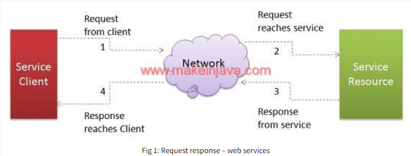
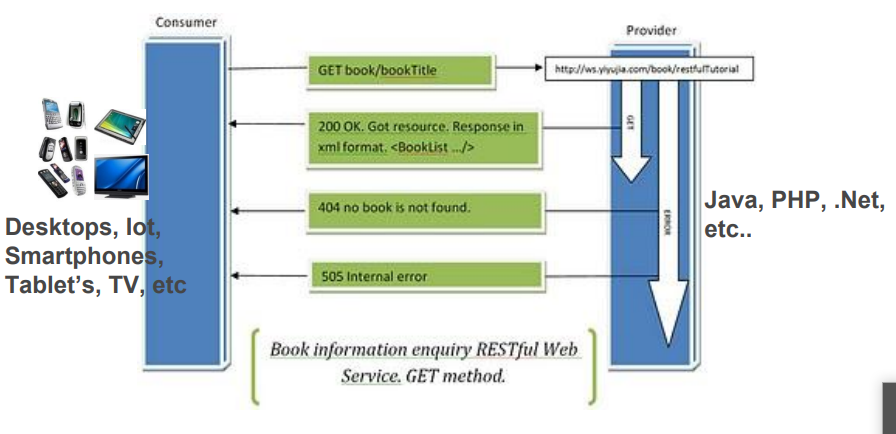
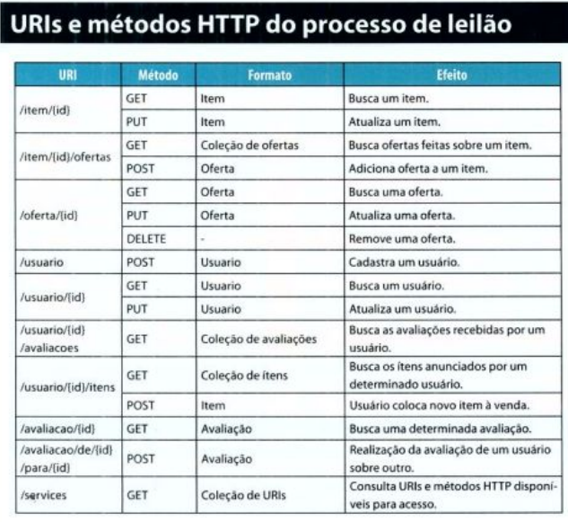
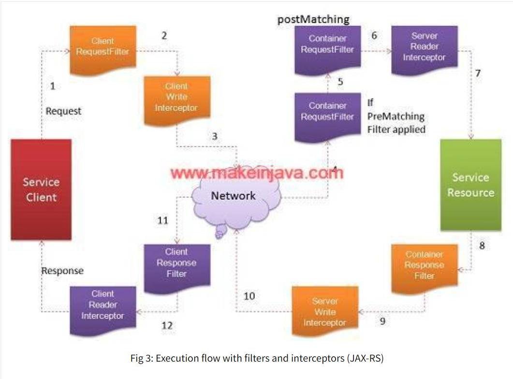
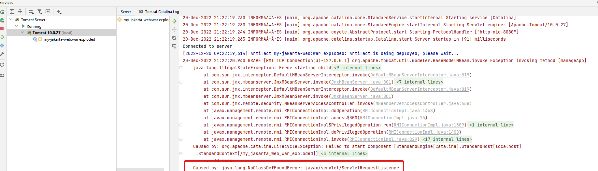

# Java Web Service - REST

**REST** - ***Respresentational State Transfer*** 
Apresentada pela tese de doutorado de Roy Fielding, autor
do protocolo HTTP,  Roy estabeleceu um conjunto de princípios que
definem como os recursos padrões de comunicação
existentes no HTTP devem ser usados para ser utilizado
como solução de web services, para oferecer integração
100% interoperável.

É uma técnica de engenharia de engenharia de software
que faz uso do protocolo HTTP como um estilo
arquitetural utilizado para comunicação (troca de
informações) entre sistemas distribuídos que lidam
simultaneamente com diversos formatos textos,
imagens, vídeos, etc.



**RESTFul**  é nome dado para as soluções que seguem
os princípios de REST como solução de web services.

Atualmente existe duas opções para criação de web services.
***SOAP ou REST.***


# Ambiente
- Java JDK8x.
- Intellij 2022.3
- Servidor WEB Grizzly2 (Embedded)
- Maven
- Jersey (implementação do JAX-RS)


# Jersey, REST e JAX-RS
***Jersey RESTful Web Services framework*** é uma estrutura de qualidade de produção de software livre para desenvolver
RESTful Web Services em Java. Jersey fornece suporte para APIs JAX-RS e serve como uma implementação de referência
***JAX-RS***.

***Jersey*** ajuda a expor seus dados em uma variedade de tipos de mídia de representação e abstrai os detalhes
de baixo nível da comunicação ***cliente-servidor***.  

***Jersey*** simplifica o desenvolvimento de serviços ***Web RESTful*** e seus clientes em Java de forma padrão e portátil. 
***Representational State Transfer (REST)*** é um estilo de arquitetura de software para criar serviços da Web escaláveis.   

***REST*** é uma alternativa mais simples aos serviços da Web baseados em ***SOAP e WSDL*** e alcançou grande popularidade.  

Os sistemas RESTful se comunicam usando o ***Hypertext Transfer Protocol (HTTP)*** usando os mesmos verbos 
***(GET, POST, PUT, DELETE, etc.)*** que os navegadores
da web usam para recuperar páginas da web e enviar dados para servidores remotos.    

A API Java para ***RESTful Web Services (JAX-RS)*** fornece APIs portáteis para desenvolver, expor e acessar aplicativos 
da Web projetados e implementados de acordo com os princípios do estilo arquitetônico REST. A versão mais recente
do ***JAX-RS é a versão 2.0.*** A estrutura de Jersey é a implementação de referência do JAX-RS.


# REST 5 Princípios fundamentais 
 
1. Um identificador [URL].  
2. Protocolo HTTP somente para definir as ações e suas
   respostas[HTTP].  
3. Recursos com múltiplas representações [MIME].  
4. Comunique sem estado [Stateless].  
5. Vincule as coisas [links].    
   

### 1. Um identificador
   Todos os serviços oferecidos no web services rest
   deve ter um identificador unico na web.     

***URIs*** para identificar todos os recursos de "alto nível" o
   aplicativo oferece, se eles representam itens
   individuais, conjuntos de itens, objetos virtuais e físicos,
   ou resultados de computação.  
   
   Assim, uma solução cliente pode interagir com um
   recurso conhecendo apenas seu identificador (URL).
   Ganhando com isso: baixo acoplamento, independência de
   plataforma e nenhuma necessidade de protocolos
   adicionais.
   
   Exemplos:  
   http://vendas.com/cliente/1234  
   http://vendas.com/vendas/2007/10/776654  
   http://vendas.com/produtos/4554  
   http://vendas.com/boleto/5248  


### 2. Utilize somente ações do protocolo HTTP   
   Use métodos do protocolo HTTP para especificar
   quais as ações serão efetuadas sobre os recursos
   disponibilizado nas URI's.

   Exemplo de um CRUD básico, com as quatro operações mais utilizados:  
    **Create - POST**  
    **Read - GET**  
    **Update - PUT**    
    **Delete - DELETE**      

- Gravar dados do cliente que será enviado dentro do corpo do protocolo HTTP:     
  **POST**  http://vendas.com/cliente 

- Obter dados do cliente 1234  
  **GET** http://vendas.com/cliente/1234    

- Atualizar dados do cliente que será enviado dentro do corpo do protocolo HTTP.  
  **PUT** http://vendas.com/cliente/1234   

- Deletar do sistema o cliente 1234  
  **DELETE** http://vendas.com/cliente/1234   
     

### 2.1 Utilize protocolo HTTP para definir as respostas
   Use status HTTP que define a resposta ao cliente daquela
   determinada requisição:  
   **HTTP 1xx** – Informativo.    
   **HTTP 2xx** – Sucesso.  
   **HTTP 3xx** – Redirecionamento.    
   **HTTP 4XX** – Erro do cliente    
   **HTTP 5XX** – Erro do servidor.    
   **SUCESSO 200** – OK – indica que o pedido foi processado com
   sucesso. Usado com GET para retornar o(s) recurso(s)
   requerido(s).  
   **SUCESSO 201** – CRIADO – indica que o(s) recurso(s) do pedido
   foram criadas com sucesso. Deve retornar no header da
   resposta a URI para o(s) recurso(s) criado(s). Usado com POST
   E PUT.  
   **SUCESSO 202** – APROVADO – indica que o pedido foi aprovado
   mas não processado. Utilizado para processamento
   assíncrono.  
   **SUCESSO 204** – SEM CONTEÚDO – indica que o pedido foi
   processado com sucesso. Usado com UPDATE e DELETE sem
   resposta (não tem BODY).  
   **ERRO CLIENTE 400** – PEDIDO INVÁLIDO – indica que o cliente
   enviou o pedido com sintaxe errada.  
   **ERRO CLIENTE 401** – NÃO AUTORIZADO – indica que o pedido
   foi recurso por requerer credencial não existente ou inválidas.  
   **ERRO CLIENTE 404** – NÃO ENCONTRADO – indica que o
   servidor não encontrou nada que corresponda á URI do
   pedido.  
   **ERRO SERVIDOR 500** – ERRO INTERNO DO SERVIDOR – o
   servidor encontrou uma condição inesperado que o impediu
   que cumprir a solicitação.


### 3. Recursos com múltiplas representações  

   Use o cabeçalho padrão de MIME do protocolo HTTP
   para especificar pelo cliente qual será o tipo do
   resultado esperado por ele na resposta das URI's,
   fazendo o próprio cliente decidir qual é o tipo do
   resultado que ele espera receber.
   
   **Exemplos:** requisição pedindo o cliente em txt ou pdf:
   ```GET /vendas.com/cliente/1234 HTTP/1.1
   Host: vendas.com
   Accept: text/txt, aplication/pdf
   Princípios - REST  
```

   Use o cabeçalho padrão de MIME do protocolo HTTP
   para especificar pelo servidor qual será o tipo do
   resultado da resposta disponibilizado nas URI's,
   fazendo com que um mesmo recurso possa ter
   dinamicamente múltiplos representações
   diferentes.

   **Exemplos:** Resposta de pedido do cliente em txt:
   ```HTTP-Version: HTTP/1.0 200 OK
   Content-Length: 3012
   Content-Type: text/txt
<body>
Ricado, 25 anos de idade, engenheiro.
</body>
```

### 4. Comunique sem estado
Crie seu web services totalmente STATELESS, sem armazenar estado 
do cliente no servidor. Isto permite alguns benefícios como:  

1. **Visibilidade:** não é necessário verificar a requisição para 
determinar sua natureza.  
 
2. **Fiabilidade:** a tarefa de recuperação a falhas parciais se torna 
fácil.   

3. **Escalabilidade:** não necessitando armazenar estados entre as 
requisições, o servidor pode rapidamente liberar recursos 
facilitando seu gerenciamento e ter escalabilidade horizontal 
facil e rapido.  


### 5. Vincule as coisas
Sempre que necessário e quando houver aplicabilidade, 
use links para referenciar outros recursos que possam 
ser identificadas dinamicamente, permitindo que a 
hipermídia funcione como máquina de estado da 
solução, a partir da própria aplicação, sem interferência 
humana. Conceito complexo chamado de **HATEOAS**.

**Exemplo de uma resposta MIME XML:**
```
HTTP-Version: HTTP/1.0 200 OK
Content-Length: 3012
Content-Type: text/xml
<body>
<pedido self="vendas.com/venda/1234"> 
 <total>23,00</total> 
 <produto ref="http://vendas.com/produto/4554"></produto>
 <cliente ref="http://vendas.com/cliente/8422"></cliente> 
</pedido>
</body>

```

Na prática, conseguimos usar os 3 primeiros princípios 
que são fundamentais e básicos para fazer um rest real.   

Já o principio do **STATELESS** é complicado, sendo em 
soluções legadas. Eu tenho rest **STATEFULL** e funciona 
muito bem.

No caso do **HATEOAS**, somente em casos que existe 
aplicabilidade e ganho real de uso. Caso contrário, nem 
usamos isso. Eu não nunca precisei usar.


# Arquitetura Rest



### Workflow de execução:
1. A solução servidora disponibiliza a lista de
recursos através de URI’s e métodos HTTP.  

2. A solução consumidora cria e envia uma
requisição HTTP para o web service REST, usando
uma URL e um específico método HTTP.  

3. A solução cliente envia informações via
parâmetros HTTP dentro do protocolo ou na própria
URL destino.  

4. A solução servidora descobre o que o cliente quer
pela URL e método HTTP. O processamento é feito
retornando algum código de resposta HTTP válido e
ou algum recurso dentro da resposta HTTP.    

5. A solução cliente consumidora descobre qual foi a
resposta (sucesso, erro, redirecionamento, etc) pelo
código da resposta HTTP, juntamente do conteúdo
vindo do processamento dentro da resposta do
protocolo HTTP.  

### Exemplo URI´s Arquitetura REST




### Orientações básicas de implementação Rest com Java  
1. Com a aplicação existente, definir quais serão os serviços expostos
   para serem invocados por outros sistemas.    

2. Definir as URL’s de cada serviço oferecido, juntamente com seus
   respectivos métodos correspondentes.    

3. Implementar uma aplicação web que:  
   - mapeie o recebimento das requisições HTTP.   
   - leitura do protocolo HTTP – requisição.    
   - execute as regras de negócio correspondente.    
   - geração da resposta ou errors no protocolo HTTP – resposta.  


### Especificação
   Suporte para o desenvolvimento de web services
   REST com Java está oficialmente disponível na
   especificação desde o JEE 6 sobre o nome de:
   JAX-RS: Java API for RESTful Web Services
  
   A implementação de referência de JAX-RS é desenvolvida como
   um projeto de código aberto e é parte do projeto GlassFish, um
   servidor de aplicações Java EE de código aberto.
   Chamada de Jersey, a JAX-RS é uma RI e destinada a ser uma
   implementação de qualidade referência para a comunidade.  


# WADL Overview
É uma linguagem baseada em XML utilizada para
descrever o funcionamento do Web Services como um
“contrato do serviço”. Trata-se de um documento
escrito em XML que além de descrever o serviço,
especifica como acessá-lo e quais as operações
disponíveis.

***WADL*** - Web Application Description Language é o
correspondente REST ao WSDL do SOAP.  

**Objetivo**
- É o mesmo do ***WSDL*** do protocolo ***SOAP*** 
- Estabelecer um contrato entre o serviço e a aplicação
cliente.
- Descrever detalhes de serviço – “o que”, “como” e
“aonde”.
- É automaticamente gerado pelo Jersey (recurso
proprietário) a partir dos recursos expostos. Use a ```URI =
“/application.wadl”```

# Servidor WEB com Grizzly 
O Project Grizzly é um serviço da Web Java puro criado usando a API NIO. O principal caso de uso do Grizzly é o 
componente do servidor web para o servidor de aplicativos GlassFish.   

Com o Grizzly, você pode criar servidores escaláveis e robustos usando NIO, além de oferecer componentes 
de estrutura estendidos, incluindo Web Framework (HTTP/S), WebSocket, Comet e muito mais!

**Ex**
```
import java.net.URI;
import javax.ws.rs.core.UriBuilder;
import org.glassfish.grizzly.http.server.HttpServer;
import org.glassfish.jersey.grizzly2.httpserver.GrizzlyHttpServerFactory;
import org.glassfish.jersey.server.ResourceConfig;

public class Servidor {

    public static void main(String[] args) {
        try {
            URI uri = UriBuilder.fromUri("http://localhost/").port(8080).build();
            ResourceConfig config = new ResourceConfig();
            config.packages("rest.exer5");
            HttpServer server = GrizzlyHttpServerFactory.createHttpServer(uri, config);
            System.out.println("servidor no ar - " + server);
            } catch (Exception e) {
            System.out.println("Erro na execucao do servidor JSE - " + e.getMessage());
        }
    }
}
```

# Cliente JAX-RS
Abaixo um codigo com varios clientes JAX-RS, acessando um serviço REST
na porta 8080. Todos os clientes devem finalizar os processo do cliente e da resposta. ```cliente.close()`, response.close()```

***Cliente1*** Acessando o método horario, testando o retorno com
```resposta.getStatus()``` e obtendo o retorno 
do serviço via ```resposta.readEntity(String.class)```.` 

***cliente2*** Acessando o método soma, passando parametros via
```@QueryParam``` na URL, testando a resposta com ```resposta.getStatus()```
obtendo o retorno do serviço via ```resposta.readEntity(Integer.class)```.**

***cliente3*** Acessando o método soma, via ```web.path()``` passando parametros via
```queryParam``` do proprio metodo que sera impresso na  URL.  
Testa a resposta com ```resposta.getStatus()```
obtendo o retorno do serviço via ```resposta.readEntity(Integer.class)```.**

***main*** Metodo ```main``` que executa os clientes declarados na classe Cliente. 
  
**Ex:**
```
import javax.ws.rs.client.Client;
import javax.ws.rs.client.ClientBuilder;
import javax.ws.rs.client.WebTarget;
import javax.ws.rs.core.Response;

public class Cliente {

    public static void cliente1() {
        Client cliente = ClientBuilder.newClient();
        WebTarget web = cliente.target("http://localhost:8080/servicos/horario");
        Response resposta = web.request().get();
        if (resposta.getStatus() == 200) {
            String horario = resposta.readEntity(String.class);
            System.out.println(horario);
        } else {
            System.out.println("erro na resposta = " + resposta.toString());
        }
        resposta.close();
        cliente.close();
    }

    public static void cliente2() {
        Client cliente = ClientBuilder.newClient();
        WebTarget web = cliente.target("http://localhost:8080/servicos/soma?v1=15&v2=15");
        Response resposta = web.request().get();
        if (resposta.getStatus() == 200) {
            Integer soma = resposta.readEntity(Integer.class);
            System.out.println("Soma é = " + soma);
        } else {
            System.out.println("erro na resposta = " + resposta.toString());
        }
        resposta.close();
        cliente.close();
    }

    public static void cliente3() {
        // chamada de endereço dinamico com parametros dinamicos.
        Client cliente = ClientBuilder.newClient();
        WebTarget web = cliente.target("http://localhost:8080/servicos");
        WebTarget requisicao = web.path("/soma").queryParam("v1", 20).queryParam("v2", 30);
        Response resposta = requisicao.request().get();
        if (resposta.getStatus() == 200) {
            Integer soma = resposta.readEntity(Integer.class);
            System.out.println("Soma é = " + soma);
        } else {
            System.out.println("erro na resposta = " + resposta.toString());
        }
        resposta.close();
        cliente.close();
    }

    public static void main(String[] args) {
        cliente1();
        cliente2();
        cliente3();
    }
}
```
# Anotações – JAX-RS
Todas as anotações estão no pacote base - ```javax.ws.rs.*.```  
**Anotação:**```@Path("/")```
   
Transforma uma classe Java (POJO)
em um recurso REST disponível via HTTP.
Devem ser aplicadas na declaração das classes criando
um path relativo de URL padrão de acesso.    
**Ex:**

```@Path(“/cliente”)```  
```puclic class ClienteRest(){...}```

   
Quando aplicados nos métodos Java (expostos como métodos
HTTP) definem um path especifico de execução, resultando na
concatenação como URL de acesso.
```
@Path(“/cliente”)  
puclic class ClienteRest(){ 

   @Path("/abertos")    
   public String vender(){
      return null;
   }
    
}
```

Modelo = path relativo + path recurso + path método.  
Exe: http://www.sistema.com/cliente/abertos  


```@Path(“/abertos/{nomeusuario}”)```  
Podem ser usados para passar parâmetros variáveis
utilizando ```{variaveis}``` que serão preenchidas na URL em tempo de
execução, nas invocações do serviços.  

Estas variáveis são automaticamente disponíveis no
métodos de serviços da classe via ```DI pelo JAX-RS````. usando a
anotação ```@PathParam```.    

**Ex:**
```
@Path("/cadastro/{username}")
public class RestCadatro {
    
    @Produces(MediaType.TEXT_PLAIN)
    public String processarCadatro(@PathParam("username") String nome) {
      }
    }

```
Podem ser usados juntamente com uma expressão regular,
oferecendo validação do recebimento da informação  

```@Path(“/abertos/{nomeusuario: [expressão regular]}”)```  


```@Path("users/{username: [a-zA-Z][a-zA-Z_0-9]*}") – Letras```

```@Path("/books/{isbn : \\d+}") – só dígitos.```  

```@Path(“/abertos/{nomeusuario: [expressão regular]}”)```  

Caso o URL venha com valores da variáveis
incompatíveis com expressão regular definida é
retornado um resposta ***HTTP 404 NOT FOUND.***  

#### MÉTODOS HTTP
Mapeiam os métodos da classe Java para responder aos
correspondentes métodos do protocolo HTTP no qual
serão automaticamente invocados pelo JAX-RS.
Devem ser aplicadas somente na declaração dos
métodos da classe recurso.
```
   @GET 
   @POST
   @PUT
   @DELETE
   @HEAD
   ```

```@QueryParam```   
Utilizado para extrair informações enviados dentro da
URL de uma requisição HTTP.  

**Ex:**
```
@Path("/venda")
public class RestVenda {

    @GET
    @Produces(MediaType.TEXT_PLAIN)
    public String vender(@QueryParam("nome") String nome, @QueryParam("produto") String produto,
            @QueryParam("tipo") @DefaultValue("pdf") String tipo) {
               System.out.println("Processando cadastro de = " + nome);
               return "Cadastro feito com sucesso para " + nome;
            }
   
     }

```  

```@DefaultValue```  
Utilizado para definir valores padrões para informações
que não foram informados dentro da URL de uma
requisição HTTP.


```@Produces```  
Mapeia o(s) tipo(s) MIME que será gerado
como resposta de um método HTTP REST.  

Quando aplicado na classe é automaticamente propagado
para todos os métodos expostos como REST.
Quando aplicado no método, sobrepõe a definição da
classe, especificando o MIME da resposta do método.  

1. Converte automaticamente, retornando os tipos:
```
String  
java.io.byte[]  
java.io.InputStream  
Reader  e  
java.io.File
```
na resposta HTTP.  
2. Usa a API JAXB para conversão automática de
objetos Java para XML e JSON.    
Caso não queira retornar com 
```@Produces``` o conteúdo também, pode ser retornado dinamicamente,
   ```com MediaType.APPLICATION_XML``` ou ```MediaType.APPLICATION_JSON```
veja no codigo abaixo:

```
import java.math.BigDecimal;

import javax.ws.rs.DefaultValue;
import javax.ws.rs.GET;
import javax.ws.rs.Path;
import javax.ws.rs.QueryParam;
import javax.ws.rs.core.MediaType;
import javax.ws.rs.core.Response;
import javax.ws.rs.core.Response.Status;

@Path("/teste")
public class RestRespostaDinamica {

    @GET
    // Veja que nao tem produces, pq nao vamos engessar...vamos retornar dinamicamente.
    public Response teste(@QueryParam("numero") @DefaultValue("1") Integer numero) {
        if (numero == 1) {
            return Response.status(Status.FORBIDDEN).type(MediaType.TEXT_PLAIN).entity("Não permitido")
                    .build();
        }
        Funcionario f = new Funcionario();
        f.setNome("Fer");
        f.setCpf(123456L);
        f.setSalario(BigDecimal.TEN);
        if (numero == 2) {
            return Response.ok().type(MediaType.APPLICATION_XML).entity(f).build();
        }
        if (numero == 3) {
            return Response.ok().type(MediaType.APPLICATION_JSON).entity(f).build();
        }
        return Response.ok().type(MediaType.TEXT_PLAIN).entity("Codigo nao tratado").build();
    }
}

```


```@Consumes```   
 Também converte automaticamente, retornando os tipos RECEBIDOS :
```
String  
java.io.byte[]  
java.io.InputStream  
Reader  e  
java.io.File
```
 na entrada de métodos vindo na requisição HTTP.  

Usa a API JAXB para conversão automática de
objetos Java para XML e JSON.

```@XmlRootElement```  
Utilizado nas classe pra fazer a conversão automatica dos Objetos Java para XML ou JSON, o
```@Produces``` atua com API JAXB trabalhando nessa conversão.

```
@XmlRootElement
public class Funcionario {...} 
```
**Ex1:** Classe REST com metodos GET, e retornos automaticos do objeto em xml ou json,  convertidos por ```@Produces```
e ```@XmlRootElement```

```
@Path("/funcionario/")
public class RestEmpresa {

    private Funcionario criar() {
        Funcionario contato = new Funcionario();
        contato.setNome("Fernando Franzini");
        contato.setCpf(98012321323L);
        contato.setSalario(new BigDecimal("59999.99"));
        return contato;
    }

    @Path("/xml")
    @GET
    @Produces(MediaType.APPLICATION_XML)
    public Funcionario servicoXml() {
        System.out.println("Criando objeto java xml");
        Funcionario contato = criar();
        return contato;
    }

    @Path("/json")
    @GET
    @Produces(MediaType.APPLICATION_JSON)
    public Funcionario servicoJson() {
        System.out.println("Criando objeto java json");
        Funcionario contato = criar();
        return contato;
    }
}
```  
**Ex2:** ```@Consumes```   
Classe REST ```RestTelefonia```, sinaliza com a anotação ```@Consumets``` que espera receber no
metodo gravar1(), um parametro,  um objeto ```Pessoa``` no formato XML.  

E no metodo gravar2(), um parametros, um objeto ```Pessoa``` no formato JSON.

```
@Path("/telefonia/")
public class RestTelefonia {

    @Path("/xml")
    @POST
    @Consumes(MediaType.APPLICATION_XML)
    public void gravar1(Pessoa pessoa) {
        System.out.println("gravando XML = " + pessoa);
    }
    
    @Path("/json")
    @POST
    @Consumes(MediaType.APPLICATION_JSON)
    public void gravar2(Pessoa pessoa) {
        System.out.println("gravando JSON = " + pessoa);
    }
}
```


Classe Cliente enviara para o serviço rest um xml, convertendo o Objeto ```Pessoa``` em um XML, 
atraves do metodo ```Entity.xml(Object)``` da classe Entity do JAX-RS. A classe pessoa esta usando 
a anotação ```XmlRootElement```

```
import java.math.BigDecimal;

import javax.ws.rs.client.Client;
import javax.ws.rs.client.ClientBuilder;
import javax.ws.rs.client.Entity;
import javax.ws.rs.client.WebTarget;
import javax.ws.rs.core.Response;

public class Cliente {
    
    public static void viaXml() {
        Pessoa fernando = new Pessoa("Fernando", 35, new BigDecimal(1000));
        Client cliente = ClientBuilder.newClient();
        WebTarget web = cliente.target("http://localhost:8080/telefonia/xml");
        Response resposta = web.request().post(Entity.xml(fernando));
        if (resposta.getStatus() == 204) {
            // 204 resposta sem corpo.
            System.out.println("objeto pessoa enviado com sucesso via XML.");
        } else {
            System.out.println("erro na resposta = " + resposta.toString());
        }
        resposta.close();
        cliente.close();
    }

    public static void viaJson() {
        Pessoa fernando = new Pessoa("Fernando", 35, new BigDecimal(1000));
        Client cliente = ClientBuilder.newClient();
        WebTarget web = cliente.target("http://localhost:8080/telefonia/json");
        Response resposta = web.request().post(Entity.json(fernando));
        if (resposta.getStatus() == 204) {
            // 204 resposta sem corpo.
            System.out.println("objeto pessoa enviado com sucesso JSON.");
        } else {
            System.out.println("erro na resposta = " + resposta.toString());
        }
        resposta.close();
        cliente.close();
    }

    public static void main(String[] args) {
        viaXml();
        viaJson();
    }
}
```
# Cliente API – JAX-RS
JAX-RS oferece uma API completa para que soluções
feitas java possam ser consumidores de web services
REST.  
## Resumo


```javax.ws.rs.client.Client```  
Utilizado para representar a sessão da conexão de
socket para o servidor.
Gerencia as chamadas de sockets de baixo nível.


```javax.ws.rs.client.ClientBuilder```  
Utilizado para criar a conexão de Socket para o
servidor.
Gerencia as chamadas de sockets de baixo nível.
Usa pattern Method Factory, facilitando o uso por
parte do programador.


```javax.ws.rs.client.WebTarget```  
Utilizado para configurar todos as detalhes e opções
existentes para executar uma chamada HTTP.
Utilizado fisicamente executar a chamada para o web
services.

```javax.ws.rs.core.Response```  
Utilizado para acessar e verificar o resultado da
execução da chamada ao web services.
Utilizado fisicamente acessar os detalhes do conteúdo
da resposta.

# Respostas com JAX-RS
 1. Métodos declarados como void são mapeados
automaticamente para gerar uma resposta HTTP
204 No Content (sem MIME).  

3. Métodos declarados como String são mapeados
automaticamente para gerar uma resposta HTTP
200 OK, convertendo o conteúdo da String no MIME
declarado.

3. Métodos declarados como Objetos Java JAXB são
mapeados automaticamente para gerar uma
resposta HTTP 200 OK, usando MIME XML ou JSON.  

Para qualquer outra combinação de retorno
será necessario a criação de um ```Entity Provider```
customizado. 


***JAX-RS*** fornece classes chamadas de ```Response``` e
```ResponseBuilder``` utilizadas para customizar
variações de possíveis retornos, tanto relacionado
com o conteúdo retornadò, bem como o status HTTP.  

***3 tipos de respostas possíveis:***
- Response - Estática  
- ResponseBuilder - Dinâmica  
- ExecptionMapper - Resposta usando ```Exceptions```, e pode ser combinada com ```Response``` e ```ResponseBuilder```  

Utilizadas para oferecer implementações de
respostas dinâmicas para serviços ```REST```. Dessa
forma não precisa mais declarar ```@Produces.```

Métodos de serviços ***JAX-RS*** podem converter
automaticamente uma ***Exception Java*** para um
Response.     

Com a ```javax.ws.rs.ext.ExceptionMapper``` é possível
parametrizar uma exception para ser
automaticamente convertida. Use em conjunto com
a anotação ```@Provider```.

**Exemplo usando Response com ExcepitonMapper:**  
1. Implementação da interface
```
public interface ServicoTitulo {
    void gravar(Titulo titulo) throws NegocioException;
    void deletar(String sacado) throws NegocioException;
    List<Titulo> listar() throws NegocioException;
}
```

2. Classe de exception de negocio
```
public class NegocioException extends Exception {
    public NegocioException(String erro) {
        super(erro);
    }
}
```
3. Implementação de ```ExceptionMapper``` usando a classe exception de negocio

```
import javax.ws.rs.core.MediaType;
import javax.ws.rs.core.Response;
import javax.ws.rs.core.Response.Status;
import javax.ws.rs.ext.ExceptionMapper;
import javax.ws.rs.ext.Provider;

@Provider
public class NegocioExceptionResponse implements ExceptionMapper<NegocioException> {
@Override
public Response toResponse(NegocioException exception) {
     return Response.status(Status.BAD_REQUEST).type(MediaType.TEXT_PLAIN).entity(exception.getMessage()).build();
    }
}
```

4. Entidade Titulo, com metodo validar, que ira subir a ```Exception``` que será capturada por ```ExceptionMapper```e
lançada como um ```BAD_REQUEST```, ```Response``` do protocolo HTTP, quando for chamado
 o metodo ```criar(new Titulo())``` sem informar o sacado e valor;.  
```
@XmlRootElement
public class Titulo {
   private String sacado;
   private Double valor;
   
       public Titulo(String sacado, double valor) {
        this.sacado = sacado;
        this.valor = valor;
    }

    public void validar() throws NegocioException {
        String erros = "";
        if (sacado == null) {
            erros += "sacado é obrigatorio; ";
        }
        if (valor == null) {
            erros += "valor é obrigatorio; ";
        }
        if (!erros.isEmpty()) {
            throw new NegocioException(erros);
        }
    }
   ...
   Gets e Setters
}
```  

5. Classe Cliente JAX-RS, fazendo as chamadas diretamente para os metodos ```POST, GET e DELETE``` 
do serviço ```RestTitulosImp``` sem utilização do browser
```
   import java.util.List;
   import javax.ws.rs.client.Client;
   import javax.ws.rs.client.ClientBuilder;
   import javax.ws.rs.client.Entity;
   import javax.ws.rs.client.WebTarget;
   import javax.ws.rs.core.GenericType;
   import javax.ws.rs.core.Response;

public class Cliente {

    private static WebTarget criar() {
        Client cliente = ClientBuilder.newClient();
        WebTarget web = cliente.target("http://localhost:8080/titulos");
        return web;
    }
    public static void criar(Titulo titulo) {
        WebTarget web = criar().path("/gravar");
        Response resposta = web.request().post(Entity.json(titulo));
        System.out.println(resposta.getStatus() + " - " + resposta.readEntity(String.class));
        resposta.close();
    }

    public static void listar() {
        WebTarget web = criar().path("/listar");
        Response resposta = web.request().get();
        System.out.println(resposta.getStatus());
        List<Titulo> titulos = resposta.readEntity(new GenericType<List<Titulo>>() {
        });
        for (Titulo titulo : titulos) {
            System.out.println(titulo.getSacado() + " - " + titulo.getValor());
        }
        resposta.close();
    }

    public static void deletar(String sacado) {
        WebTarget web = criar().path("/deletar");
        Response resposta = web.queryParam("sacado", sacado).request().delete();
        System.out.println(resposta.getStatus() + " - " + resposta.readEntity(String.class));
        resposta.close();
    }

    public static void main(String[] args) {
        criar(new Titulo());
        criar(new Titulo("Fernando", 120));
        criar(new Titulo("Luana", 220));
        criar(new Titulo("Xicao", 550));
        listar();
        deletar("bart");
        deletar("Xicao");
        listar();
    }
}
```


# Filtros JAX-RS

Recursos oferecidos pela JAX-RS com o objetivo de
interpor as requisições e as respostas HTTP, tanto no
cliente como no servidor.  

Eles permitem que você centralize um determinado
comportamento comum que corte várias partes do
seu aplicativo, evitando espalhar essa determinada
intenção em vários lugares diferentes.

#### Para que servem?
Ter ***um ponto de implementação global*** que ofereça
a solução um ponto de ***cross-cutting concern***,
relacionado ao gerenciamento do conteúdo do
protocolo HTTP, no qual exista a possiblidade de
acessar e alterar itens relacionado ao HTTP:  
***headers, URIs, HTTP methods, cookies, cache e etc.***


**Observação**  
- Mesma coisa de um servlet filter.  
- Mesma coisa de um serviço AOP.  
- Mesma coisa de um pattern decorator.  

### Existe 4 tipos de filtros  

1. Requisição de servidor.  
2. Resposta de servidor.  
3. Requisição de cliente.  
4. Resposta de cliente.  

**Nota**  
Cada um tem um  contrato de interface diferente.

### 1. Filtro de Requisição de Servidor:
**O que é?**   
Objeto que filtra exclusivamente as requisições HTTP
que **entram** no **servidor REST**. É executado antes da classe de serviço REST.

**Para que serve?**    
Executando alguma coisa de interesse da solução,
acessando, manipulando, alterando ou
redirecionando a requisição HTTP.

**Como usar?**  
1) Implementar a interface ```ContainerRequestFilter```.  
2) Sobrepor o método ```public void filter(ContainerRequestContext requestContext).```    
3) Anotar a classe com ```@Provider``` para o provedor
carregar automaticamente como configuração.  

```ContainerRequestContext```
Serve para dar acesso e controle as informações da requisição


#### Aplicabilidade do filtro de requisição de servidor?
- Validação coisas de http: headers, cookies e etc.  
- Autenticação.  
- Autorização.  
- Logg.  
- Auditoria  
- Inicialização de recursos da solução.  
- Qualquer intenção se em caixe dentro do contexto de
cross-cutting concern. 

**Ex: 1**  
Classe de filtro ```FiltroHorario``` implementa o método ```filter``` da interface
```ContainerRequestFilter```,  que recebe como parametro ```ContainerRequestContext``` o request.  

A classe ```FiltroHorario``` sera chamada e executada antes da execução da classe de serviço ```RestHorario```.

```

import java.io.IOException;
import javax.ws.rs.container.ContainerRequestContext;
import javax.ws.rs.container.ContainerRequestFilter;
import javax.ws.rs.ext.Provider;

@Provider
public class FiltroHorario implements ContainerRequestFilter {
    @Override
    public void filter(ContainerRequestContext request) throws IOException {
        System.out.println("-->filtro de request");
    }
}
```

Classe ```RestHorario``` de serviço que sera executada, após a classe de filtro, acima.
```
import java.text.SimpleDateFormat;
import java.util.Date;
import javax.ws.rs.GET;
import javax.ws.rs.Path;
import javax.ws.rs.Produces;
import javax.ws.rs.core.MediaType;

// Teste http://localhost:8080/horas1
@Path("/horas1")
public class RestHorario {
    private SimpleDateFormat sdf = new SimpleDateFormat("HH:mm:ss dd/MM/yyyy");
    @GET
    @Produces(MediaType.TEXT_PLAIN)
    public String horario() {
        System.out.println("=>RestHorario.horario()");
        return sdf.format(new Date());
    }
}
```

**Ex: 2**
Classe de filtro, acessando os itens no **Headers** e imprimindo na tela.
```
import java.io.IOException;
import javax.ws.rs.container.ContainerRequestContext;
import javax.ws.rs.container.ContainerRequestFilter;
import javax.ws.rs.ext.Provider;


// Executada depois do processamento da classe de serviço REST
@Provider
public class FiltroCabecalhos implements ContainerRequestFilter {
	@Override
	public void filter(ContainerRequestContext request) throws IOException {
		request.getHeaders().forEach((h, l) -> {
			System.out.println("Header: " + h);
			l.forEach(i -> System.out.println("===>" + l));
		});
	}
}
```


### 2. Filtro de Resposta de Servidor
 É um objeto que filtra exclusivamente as respostas HTTP que
**saem** do **servidor REST.**  
Serve para executar alguma coisa de interesse da solução,
acessando, manipulando, alterando ou redirecionando a
resposta HTTP.  

**Como usar?**  
1) Implementar a interface ContainerResponseFilter e sobrepor o método ```public void  
filter(ContainerRequestContext crc, ContainerResponseContext response)```   
2) Anotar a classe com ```@Provider``` para o provedor
carregar automaticamente como configuração.  


O ```ContainerResponseContext``` serve para  dar acesso e controle as informações da resposta HTTP.

#### Aplicabilidade do filtro de resposta do servidor?
- Alterar itens http globais da solução.
- Finalização de recursos do servidor.
- Fazer cache http.
- Logg.
- Auditoria.
- Qualquer intenção se em caixe dentro do contexto de ***cross-cutting concern***

**Ex: 1**  
Classe ``` FiltroRespostaHorario``` implementa a interface  ```ContainerResponseFilter```  
e sobreescreve o metodo ```filter``` dessa interface, que possui os parametros de Resquest e Response:  
```ContainerRequestContext``` e ```ContainerResponseContext ```  

```
import java.io.IOException;
import javax.ws.rs.container.ContainerRequestContext;
import javax.ws.rs.container.ContainerResponseContext;
import javax.ws.rs.container.ContainerResponseFilter;
import javax.ws.rs.ext.Provider;

@Provider
public class FiltroRespostaHorario implements ContainerResponseFilter {
	@Override
	public void filter(ContainerRequestContext crc, 
			ContainerResponseContext response) throws IOException {
		System.out.println("-->filtro de response");
	}
}
```
**Ex: 2**  
Adicionando a resposta uma **Chave/Valor** no **Headers** da requisição.

```
@Provider
public class FiltroRespostaHeader implements ContainerResponseFilter {
    @Override
    public void filter(ContainerRequestContext crc, 
    		ContainerResponseContext response) throws IOException {
        response.getHeaders().add("Criado-Por", "AulaJava");
    }
}
```

# 3. Filtro de Requisição do Cliente
É o objeto que filtra exclusivamente as requisições HTTP que
**saem** ao **cliente REST.**   
E serve para Executar alguma coisa de interesse do cliente,
acessando, manipulando e alterando a requisição HTTP,
**antes da requisição ser enviada ao servidor.**

**Como usar?**
1) Implementar a interface ```ClientRequestFilter```.      
2) Sobrepor o método ```public void filter(ClientRequestContext request)```.  
3) Adicionar manualmente usando o metodo ```Client.register()```

O parametro ```ClientRequestContext``` serve para dar acesso e controle as informações da requisição HTTP.


#### Aplicabilidade Filtro de Requisição de Cliente?
- Alterar itens ***http genéricos e globais da solução***.  
- Enviar ***headers de autenticação, tokens*** ou qualquer tipo
de identificadores customizados.  
- Logg.  
- Auditoria.  
- Qualquer intenção se em caixe dentro do contexto de ***cross-cutting concern***

**Exemplo completo:**  
Instanciando a Classe Cliente  ```Client cliente = ClientBuilder.newClient();``` ClientBuilder usada para criar
uma instancia de Client WEB JAX-RS, regìstrando a classe de  filtro no cliente com o metodo register ```cliente.register(FiltroCliente.class);```.

```
import javax.ws.rs.client.Client;
import javax.ws.rs.client.ClientBuilder;
import javax.ws.rs.client.WebTarget;
import javax.ws.rs.core.Response;

public class Cliente {
   public static void main(String[] args) {
   
   Client cliente = ClientBuilder.newClient();
   // Na primeira vez, execute sem registrar.
   // Na segunda vez, registre e veja liberar o 403
   cliente.register(FiltroCliente.class);
   
   WebTarget web = cliente.target("http://localhost:8080/logar");
   Response resposta = web.request().get();
   
   if (resposta.getStatus() == 200) {
      String mensagem = resposta.readEntity(String.class);
      System.out.println(mensagem);
   } else {
      System.out.println("erro na resposta = " + resposta.toString());
}
   resposta.close();
   cliente.close();
}
}
```
Classe de filtro ```FiltroAutenticador```, sera executada antes da classe de serviço
REST ```RestAutenticacao```   

```
import java.io.IOException;

import javax.ws.rs.container.ContainerRequestContext;
import javax.ws.rs.container.ContainerRequestFilter;
import javax.ws.rs.core.Response;
import javax.ws.rs.ext.Provider;

@Provider
public class FiltroAutenticador implements ContainerRequestFilter {
	@Override
	public void filter(ContainerRequestContext request) throws IOException {
		if (request.getHeaderString("usuario") == null) {
			request.abortWith(Response.status(Response.Status.FORBIDDEN)
					.entity("Usuario obrigatorio!").build());
		}
	}
}

```

Classe ```FiltroAutenticador```   
Implementa a interface ```ContainerRequestFilter``` de ***cross-cutting concern*** 
que verifica se o usuário esta no Header da requisição, caso não esteja,
ira inserir no request ```request.abortWith(Response.status(Response.Status.FORBIDDEN)
.entity("Usuario obrigatorio!").build());``` e retornar uma msg que um usuario é obrigatorio no Headers,
para fazer a requisição cliente. Dos filtros sempre será executado primeiro a classe
que implementa  a interface ```ContainerRequestFilter``` caso não tenha registros de 
filtros ```ClientRequestFilter ``` do cliente antes da chamada da classe de implementação de ```ContainerRequestFilter``` .

```
import java.io.IOException;

import javax.ws.rs.container.ContainerRequestContext;
import javax.ws.rs.container.ContainerRequestFilter;
import javax.ws.rs.core.Response;
import javax.ws.rs.ext.Provider;

@Provider
public class FiltroAutenticador implements ContainerRequestFilter {
	@Override
	public void filter(ContainerRequestContext request) throws IOException {
		if (request.getHeaderString("usuario") == null) {
			request.abortWith(Response.status(Response.Status.FORBIDDEN)
					.entity("Usuario obrigatorio!").build());
		}
	}
}
```  

Classe ```FiltroCliente```   
Implementa o metodo 
```public void filter(ClientRequestContext request) throws IOException {...} ``` da interface ```ClientRequestFilter```
responsável por permitir por exempl, que um usuário seja inserido no header do request do cliente antes 
de executar a classe de serviço ```RestAutenticacao```

```
public class FiltroCliente implements ClientRequestFilter {
	@Override
	public void filter(ClientRequestContext request) throws IOException {
		List<Object> header = new ArrayList<Object>();
		header.add("Fernando");
		request.getHeaders().add("usuario", header);
	}
}
```

# 4. Filtro de Resposta de Cliente:
É o objeto que filtra exclusivamente as respostas HTTP que
**chegam ao cliente REST.**  
Serve para executar alguma coisa de interesse do cliente,
acessando, manipulando ou alterando a resposta HTTP,
depois que o servidor já respondeu.

**Como usar?**   
1) Implementar a interface ```ClientResponseFilter````.
2) Sobrepor o método ```public void filter(ClientResponseContext request)```.
3) Registrar manualmente o filtro de resposta usando o metodo ```Client.register()```

O  ```ClientResponseContext``` serve para dar acesso ao as informações da requisição HTTP. 


#### Aplicabilidade Resposta de Cliente?
- Logg.  
- Auditoria.  
- Qualquer intenção se em caixe dentro do contexto de ***cross-cutting concern*** 

**Ex:1**  
Classe cliente, registra um filtro para obter a quantidade de caracteres retornados.
Le o planText de retorno da resposta(o numero randomico) e converte em String.

```
import javax.ws.rs.client.Client;
import javax.ws.rs.client.ClientBuilder;
import javax.ws.rs.client.WebTarget;
import javax.ws.rs.core.Response;

public class Cliente {
	public static void main(String[] args) {
		Client cliente = ClientBuilder.newClient();
		cliente.register(FiltroNumero.class);
		WebTarget web = cliente.target("http://localhost:8080/numerorandomico");
		Response resposta = web.request().get();
		if (resposta.getStatus() == 200) {
			String mensagem = resposta.readEntity(String.class);
			System.out.println(mensagem);
		} else {
			System.out.println("erro na resposta = " + resposta.toString());
		}
		resposta.close();
		cliente.close();
	}
}

```
Classe de filtro
```
import java.io.IOException;
import javax.ws.rs.client.ClientRequestContext;
import javax.ws.rs.client.ClientResponseContext;
import javax.ws.rs.client.ClientResponseFilter;

public class FiltroNumero implements ClientResponseFilter {
	@Override
	public void filter(ClientRequestContext requestContext, 
			ClientResponseContext response) throws IOException {
		System.out.println("tamanho da resposta - "+ response.getLength());
	}
}
```
Serviço REST de geração de números randômicos
```
import java.util.Random;
import javax.ws.rs.GET;
import javax.ws.rs.Path;
import javax.ws.rs.Produces;
import javax.ws.rs.core.MediaType;
// Teste http://localhost:8080/numerorandomico
@Path("/numerorandomico")
public class RestNumero {
    @GET
    @Produces(MediaType.TEXT_PLAIN)
    public String processarCadatro() {
        Random numero = new Random();
        return "Numero  = " + numero.nextInt(10000);
    }
}
```

# Interceptores JAX-RS  
Interceptores JAX-RS **são recursos** oferecidos pela **JAX-RS** com o objetivo de
**interpor as requisições e as respostas**, **tanto no cliente como no servidor.**  

Eles permitem que você centralize um determinado
o comportamento comum que corte várias partes do
seu aplicativo, evitando espalhar essa determinada
intenção em vários lugares diferentes.  

Servem como um ponto de implementação global que ofereca
a solução ponto de ***cross-cutting concern***,  relacionado ao gerenciamento do conteúdo das
requisições REST (Corpo), no qual exista a possiblidade de acessar 
e alterar itens do proprio conteúdo trafegado.  

**Mesma coisa que um:**     
- Servlet filter.  
- Serviço AOP.  
- Pattern decorator.  

## Existem 4 tipos de interceptores:  
- Escrita de servidor
- Escrita de cliente.
- Leitura de servidor
- Leitura de cliente.

**Nota:** Todos usam  o mesmo contrato de interface.
 


## 1. Interceptor de Escrita - Servidor e Cliente
Usa a mesma interface tanto para o servidor quanto para
o cliente.  

**O que é no Servidor?**    
Objeto que filtra exclusivamente a escrita do conteúdo
das respostas que saem do servidor.  

**O que é no Cliente?**  
Objeto que filtra exclusivamente a escrita do conteúdo
das requisição que saem do cliente.
Interceptores JAX-RS

**Para que serve no Servidor?**  
Executando alguma coisa de interesse da solução,
acessando, manipulando, alterando o conteúdo da
requisição, antes de ser enviado ao cliente.  

**Para que serve no Cliente?**
Executando alguma coisa de interesse da solução,
acessando, manipulando, alterando o conteúdo da
requisição, antes de ser enviado ao servidor.
  

**Como usar?**  
1) Implementar a interface WriterInterceptor.   
2) Sobrepor o método ```public void aroundWriteTo(WriterInterceptorContext context)```    
3) No servidor: anotar a classe com ```@Provider``` para o
provedor carregar automaticamente como configuração.    
3) No cliente: adicionar manualmente ao usando o
método ```Client.register()```  

WriterInterceptorContext serve para dar acesso e controle ao conteúdo da corpo da
requisição. 

**Ex:1**  
A classe ```GzipServidor``` implementa  a interface ```WriterInterceptor {}```
que compacta com ```GZIPOutputStream``` o conteúdo a ser enviado ao cliente.
e atualiza o contexto com o arquivo alterado. vai imprimir somente simbolos
da compactação, inelegiveis.
```

import java.io.IOException;
import java.util.zip.GZIPOutputStream;
import javax.ws.rs.WebApplicationException;
import javax.ws.rs.ext.Provider;
import javax.ws.rs.ext.WriterInterceptor;
import javax.ws.rs.ext.WriterInterceptorContext;

@Provider
public class GzipServidor implements WriterInterceptor {
    @Override
    public void aroundWriteTo(WriterInterceptorContext ctx) 
    		throws IOException, WebApplicationException {
        GZIPOutputStream os = new GZIPOutputStream(ctx.getOutputStream());
        ctx.setOutputStream(os);
        ctx.proceed();
        return;
    }
}

```

Classe de geração de lista de telefones nome e numero. Ira retornar uma
lista no formato JSON, sinalizado por ```@Produces(MediaType.APPLICATION_JSON)```
```
import java.util.ArrayList;
import java.util.List;
import javax.ws.rs.GET;
import javax.ws.rs.Path;
import javax.ws.rs.Produces;
import javax.ws.rs.core.MediaType;

@Path("/telefones")
public class ListaTelefonica {
    @GET
    @Produces(MediaType.APPLICATION_JSON)
    public List<Telefone> processarCadastro() {
        List<Telefone> lista = new ArrayList<>();
        for (int i = 0; i < 1000; i++) {
            lista.add(new Telefone("Nome " + i, "3325-750" + i));
        }
        return lista;
    }
}

```
Classe ```Telefone``` entidade de criação da lista de telefones.
```
import javax.xml.bind.annotation.XmlRootElement;

//Declaracao de Elemento JAXB para conversao automatica.
@XmlRootElement
public class Telefone {
    private String nome;
    private String fone;
    public Telefone() {
    }
    public Telefone(String nome, String fone) {
        super();
        this.nome = nome;
        this.fone = fone;
    }
    ...
    Gettes e Setts
```
}

#### 3. Aplicabilidade do interceptor de escrita:  
- Logg
- Auditoria
- Validação de tipo de conteúdo.
- Alteração do conteúdo.
- Acréscimo de conteúdo padrão na resposta.
- Compactação e descompactação da resposta (Ex: GZIP)
- Qualquer intenção se em caixe dentro do contexto de cross-cutting concern


## 2. Interceptor de Leitura - Servidor e Cliente
Usa a mesma interface tanto para o servidor quanto para
o cliente.  

**O que é no Servidor?**  
Objeto que filtra exclusivamente a **leitura** do conteúdo
das requisições que **chegam** ao servidor.

**O que é no Cliente?**  
Objeto que filtra exclusivamente a **escrita** do conteúdo
das requisições que **chegam** ao cliente.


**Para que serve no Servidor?**  
Executando alguma coisa de interesse da solução,
acessando, manipulando, alterando o conteúdo da
requisição, depois de ser enviado ao cliente.

**Para que serve no Cliente?**  
Executando alguma coisa de interesse da solução,
acessando, manipulando, alterando o conteúdo da
requisição, depois de ser enviado pelo servidor.

**Como usar?**  
1) Implementar a interface ```ReadInterceptor```.    
2) Sobrepor o método ```public Object`aroundReadFrom(ReaderInterceptorContext context)```    
3) No servidor: anotar a classe com ```@Provider``` para o
provedor carregar automaticamente como configuração.   
4) No cliente: adicionar manualmente ao usando o
método ```Client.register()```.  


***ReaderInterceptorContext*** 
Serve para dar acesso e controle ao conteúdo do corpo da
requisição. 

#### Aplicabilidade interceptador leitura:
- Logg.  
- Auditoria.  
- Validação de tipo de conteúdo.  
- Alteração do conteúdo.  
- Acréscimo de conteúdo padrão na resposta.  
- Compactação e descompactação da resposta (Ex: GZIP)  
- Qualquer intenção se em caixe dentro do contexto de  
cross-cutting concern

**Ex:1**  

Classe ```Cliente```, registra o interceptor, que ira compactar o arquivo enviado.
```resposta.readEntity(new GenericType<List<Telefone>>()```le o conteudo da resposta 
descompactado retornando uma lista de Telefones.
```
import java.util.List;
import javax.ws.rs.client.Client;
import javax.ws.rs.client.ClientBuilder;
import javax.ws.rs.client.WebTarget;
import javax.ws.rs.core.GenericType;
import javax.ws.rs.core.Response;
import rest.exer16.Telefone;

public class Cliente {
    public static void main(String[] args) {
        Client cliente = ClientBuilder.newClient();
        
        // Execute a primeira vez e veja que vai dar exception pq o conteudo vem zipado.
        cliente.register(GzipCliente.class);
        
        WebTarget web = cliente.target("http://localhost:8080/telefones");
        Response resposta = web.request().get();
        List<Telefone> telefones = resposta.readEntity(new GenericType<List<Telefone>>() {
        });
        for (Telefone t : telefones) {
            System.out.println(t.getNome() + " - " + t.getFone());
        }
        resposta.close();
    }
}
```
Classe ```GzipCliente```, implementa ```WriterInterceptor {} ``` que 
intercepta o conteudo enviado ao cliente.`E altera o contexto
inserindo o arquivo obtido no request descompacatando, e inserindo o conteudo no context da
aplicacação  

```
import java.io.IOException;
import java.io.InputStream;
import java.util.zip.GZIPInputStream;

import javax.ws.rs.WebApplicationException;
import javax.ws.rs.ext.ReaderInterceptor;
import javax.ws.rs.ext.ReaderInterceptorContext;

public class GzipCliente implements ReaderInterceptor {
    @Override
    public Object aroundReadFrom(ReaderInterceptorContext context) throws IOException,
            WebApplicationException {
        InputStream originalInputStream = context.getInputStream();
        context.setInputStream(new GZIPInputStream(originalInputStream));
        return context.proceed();
    }
}

```
# Testes com Postman
```
import java.net.URI;
import javax.ws.rs.core.UriBuilder;
import org.glassfish.grizzly.http.server.HttpServer;
import org.glassfish.jersey.grizzly2.httpserver.GrizzlyHttpServerFactory;
import org.glassfish.jersey.server.ResourceConfig;

public class ServidorPostman {
public static void main(String[] args) {
try {
      URI uri = UriBuilder.fromUri("http://localhost/").port(8080).build();
      ResourceConfig config = new ResourceConfig();
      config.packages("rest.exer1");
      config.packages("rest.exer5");
      HttpServer server = GrizzlyHttpServerFactory.createHttpServer(uri, config);
      System.out.println("servidor no ar teste - " + server);
      // teste http://localhost:8080/application.wadl = veja que aparece todos os servicos
      // Teste http://localhost:8080/ola
      // Teste http://localhost:8080/funcionario/xml
      // Teste http://localhost:8080/funcionario/json
      } catch (Exception e) {
         System.out.println("Erro na execucao do servidor JSE - " + e.getMessage());
      }
   }
}
```
***Observação:***
Filter e interceptor podem ser utilizados ao mesmo
tempo.
Podemos ter vários de cada um deles.
Atenção para sequência de execução.

# Tipos de Deploy - JAX-RS
Existem 3 tipos diferentes de “EndPoint” que os
desenvolvedores Java podem disponibilizar serviços web
com JAX-RS:  
1. POJO com servidor Grizzly.  
2. Servlet com servidor Web Container.  
3. EJB com servidor EJB Container (Middleware).  

## 1. POJO com o servidor Grizzly:
 Indicado para ambiente de desenvolvimento e
testes, uma vez que não possui os recursos de um
servidor de aplicação web completo: ciclo de vida de
objetos, pooling de objetos, pooling de data source,
multithread, gerenciamento de sessão, SSL,
autenticação, autorização, LOG etc…

## 2. Servlet com servidor Web Container:  
Indicado para ambiente de produção no qual a solução não
tem camada de negócio remotamente separada como serviço.  

A especificação do web container servlet cobre todos os
serviços básicos para um servidor web: ciclo de vida de
objetos, pooling de objetos, pooling de data source,
multithread, gerenciamento de sessão, SSL, autenticação,
autorização, LOG etc...

## 3. EJB com servidor EJB Container:  
Indicado para ambiente de produção no qual a solução tenha a
camada de negócio remotamente separada como serviço. O serviço
pode usar todos os produtos especificados no EJB container.  


# Dicas Gerais de JAX-RS

### Cliente JAX-RS no Android  
É possível consumir web services rest usando jax-rs +
jersey dentro do android.  

### Validação com JAX-RS  
JAX-RS suporta integração nativa com a
especificação Java Bean Validation. Sendo assim,
é possível utilizar um provedor para validar todas
os dados vindo de parâmetros/objetos recebidos
nos endpoint rest.  

Segue documentação oficial:
https://jersey.java.net/documentation/latest/bean-validation.html

### Processamento Assíncrono com JAX-RS
JAX-RS suporta integração nativa com a
especificação java.util.concurrent.Future. Sendo
assim, é possível criar e executar chamadas de
cliente REST e fazer processamento de server
REST 100% assíncrona.  

Segue documentação oficial:
https://jersey.java.net/documentation/latest/async.html

### MVC Action-Like com Jersey
Jersey tem uma extensão proprietária que oferece
serviço de um framework web “mvc action-like”.
Segue documentação oficial:
https://jersey.java.net/documentation/latest/mvc.html

### Segurança com JAX-RS
Web services baseado em REST podem utilizar
vários mecanismos diferentes de segurança:  
- Autenticação HTTP – Basic ou Digest.  
- HTTPS Client Certificate Authentication.  
- Proprietária com credenciais no HEADER do HTTP.  
- Proprietária com Servlet Filter.  
- Frameworks de terceiros: Spring Security, Apache
Shiro ou etc...

### Segurança com JAX-RS
- Web services baseado em REST podem utilizar
autenticação oAuth:
- Jersey tem suporte.oAuth1 –
https://jersey.java.net/documentation/latest/security.html#d0e12588  

- Jersey tem suporte.oAuth2 – 
https://wikis.oracle.com/display/Jersey/OAuth    
- Confiabilidade e Integridade – SSL sobre HTTP-HTTPS

# Criando projeto Web Service com Jakarta EE no Intellij
)

## Erro
Ao startar o Tomcat server o erro é exibido


## Solução
Comentar no pom.xml a dependencia do Javax
```
    <!--<dependency>
            <groupId>javax</groupId>
            <artifactId>javaee-web-api</artifactId>
            <version>8.0.1</version>
            <scope>provided</scope>
        </dependency>-->
```
E inserir no pom.xml as dependencias abaixo, do Jakarta EE  

```
  <dependency>
            <groupId>jakarta.servlet</groupId>
            <artifactId>jakarta.servlet-api</artifactId>
            <version>5.0.0</version>
            <scope>provided</scope>
        </dependency>
        <dependency>
            <groupId>jakarta.servlet.jsp</groupId>
            <artifactId>jakarta.servlet.jsp-api</artifactId>
            <version>3.0.0</version>
            <scope>provided</scope>
        </dependency>
        <dependency>
            <groupId>jakarta.el</groupId>
            <artifactId>jakarta.el-api</artifactId>
            <version>4.0.0</version>
            <scope>provided</scope>
        </dependency>
        <dependency>
            <groupId>jakarta.websocket</groupId>
            <artifactId>jakarta.websocket-api</artifactId>
            <version>2.0.0</version>
            <scope>provided</scope>
        </dependency>
        <dependency>
            <groupId>jakarta.security.enterprise</groupId>
            <artifactId>jakarta.security.enterprise-api</artifactId>
            <version>2.0.0</version>
            <scope>provided</scope>
        </dependency>
        <dependency>
            <groupId>org.junit.jupiter</groupId>
            <artifactId>junit-jupiter-api</artifactId>
            <version>${junit.version}</version>
            <scope>test</scope>
        </dependency>
        <dependency>
            <groupId>org.junit.jupiter</groupId>
            <artifactId>junit-jupiter-engine</artifactId>
            <version>${junit.version}</version>
            <scope>test</scope>
        </dependency>

```

Alterar os imports do arquivo de ```import javax.servlet.http.*;``` para 
```import jakarta.servlet.http.*;```

Essa alteração nas dependências do pom.xml é necessario devido a incompatibilidade
do Tomcat10 com as classes do pacote javax que foram refatoradas para o pacote jakarta  
Segue link da questão:  
https://stackoverflow.com/questions/65703840/how-to-properly-configure-jakarta-ee-libraries-in-maven-pom-xml-for-tomcat/65704617#65704617


# Referências


**Cliente JAX-RS no Android** veja:  
https://fernandofranzini.wordpress.com/2015/09/03/usando-jax-rs-para-consumir-rest-no-android

**Referência Bibliográfica - JAX-RS**  
RESTful Java with JAX-RS 2.0: Designing and Developing  
Distributed Web Services 2nd Edition, author Bill Burke

**WriterInterceptorContext** veja javadoc:  
https://docs.oracle.com/javaee/7/api/javax/ws/rs/ext/WriterInterceptorContext.html

**ReaderInterceptorContext** veja javadoc:  
https://docs.oracle.com/javaee/7/api/javax/ws/rs/ext/readerInterceptorContext.html

**ClientResponseContext** veja javadoc:  
https://docs.oracle.com/javaee/7/api/javax/ws/rs/client/ClientResponseContext.html


**ClientRequestContext** veja javadoc:  
https://docs.oracle.com/javaee/7/api/javax/ws/rs/client/ClientRequestContext.html.

  
**Container javadoc:**  
http://docs.oracle.com/javaee/7/api/javax/ws/rs/container/ContainerRequestContext.html


**Cross-cutting concern**  
https://pt.wikipedia.org/wiki/Cross-cutting_concern

**WADL**  
http://www.w3.org/Submission/wadl/

**Jersey**  Link oficial  
http://jersey.dev.java.net/

**Opções de providers de JAX-RS:**  
Jersey – http://jersey.java.net/  
Restlet - http://restlet.com/technical-resources/restlet-framework/guide/2.2/extensions/jaxrs  
RestEasy – http://www.jboss.org/resteasy/    
Serfj – http://serfj.sourceforge.net/    
CXF – http://cxf.apache.org/  

**Opções de produtos rest Java**  
Spring-MVC – https://spring.io/guides/gs/rest-service/    
Spark – http://sparkjava.com/  
Groovy-wslite -  
https://github.com/jwagenleitner/groovy-wslite  
Grails – http://grails.org/index.html  
Struts 2 – http://struts.apache.org/docs/rest-plugin.html

**HATEOAS:**   
https://en.wikipedia.org/wiki/HATEOAS

**Protocolo HTTP:**  
https://www.tutorialspoint.com/http/http_methods.html  

https://pt.wikipedia.org/wiki/Hypertext_Transfer_Protocol  

**Especificação:**  
http://www.w3.org/Protocols/rfc2616/rfc26

